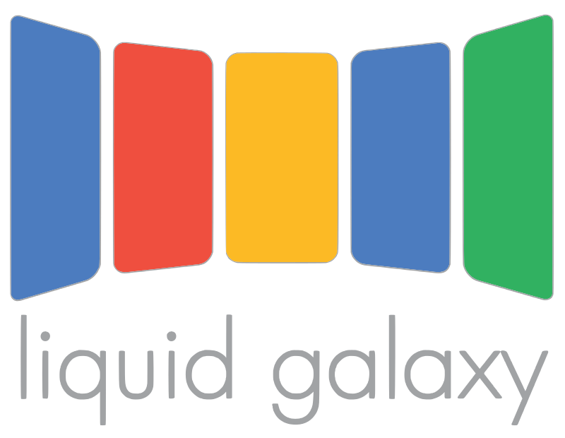

# lgdemoapp 🎉

> This app repo is just a demo
 
LG Pre-Selection Stage 2 App 

## What does it do? 🧐
Nothing much, just displays basic programming abilities and logic... maybe ability to read docs... or to just get it done...

Being a dart and hence flutter beginner I can cite my sources (Darn you AI)

## My Sources/Docs/Citations 📚
https://docs.flutter.dev/get-started/install/macos

https://docs.flutter.dev/get-started/editor

https://docs.flutter.dev/get-started/flutter-for/android-devs

https://dart.dev/overview
> Personal Note: Dart is pretty pog, I like how it handles class/object initializers... syntax and some inbuilt functions are similar to JS/TS as well! Definitely a language I will come back to!

https://docs.flutter.dev/release/breaking-changes/buttons
https://www.javatpoint.com/flutter-buttons

https://stackoverflow.com/questions/66833689/flutter-no-scaffoldmessenger-widget-found
https://docs.flutter.dev/cookbook/design/snackbars

and many more... 💀

 

<!-- ## Getting Started

This project is a starting point for a Flutter application.

A few resources to get you started if this is your first Flutter project:

- [Lab: Write your first Flutter app](https://docs.flutter.dev/get-started/codelab)
- [Cookbook: Useful Flutter samples](https://docs.flutter.dev/cookbook)

For help getting started with Flutter development, view the
[online documentation](https://docs.flutter.dev/), which offers tutorials,
samples, guidance on mobile development, and a full API reference. -->
